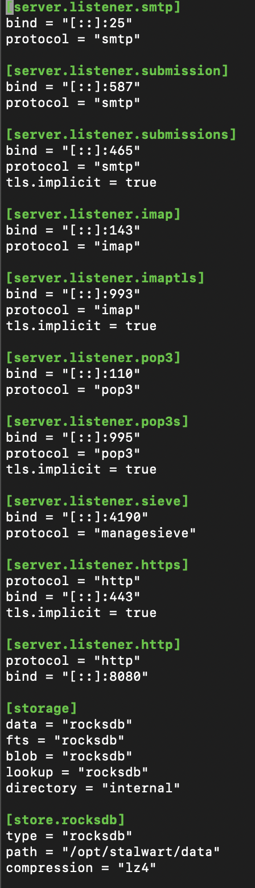
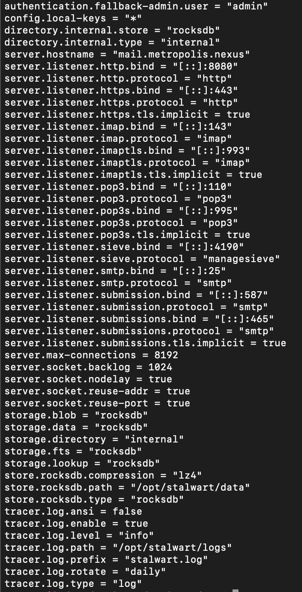

# Stalwart-Setup

## Deploy NGINX

- Install required dependencies: 

```bash
sudo rpm-ostree install certbot nginx policycoreutils-python-utils
sudo reboot
```

- Run [setup.sh](https://github.com/Metropolis-nexus/NGINX-Setup) to get a simple standard NGINX setup.
- Generate a certificate for the mail server with certbot:

```bash
sudo certbot certonly \
    --webroot --webroot-path /srv/nginx \
    --no-eff-email \
    --key-type ecdsa \
    --reuse-key \
    --deploy-hook "nginx -s reload && systemctl restart stalwart" \
    -d mail.yourdomain.tld
```

- Add `/etc/nginx/conf.d/stalwart.conf`:

```
server {
    listen 443 quic;
    listen 443 ssl;
    listen [::]:443 quic;
    listen [::]:443 ssl;

    server_name mail.yourdomain.tld;

    ssl_certificate /etc/letsencrypt/live/mail.yourdomain.tld/fullchain.pem;
    ssl_certificate_key /etc/letsencrypt/live/mail.yourdomain.tld/privkey.pem;
    ssl_trusted_certificate /etc/letsencrypt/live/mail.yourdomain.tld/chain.pem;

    include snippets/security.conf;
    include snippets/cross-origin-security.conf;
    include snippets/quic.conf;
    include snippets/proxy.conf;
    include snippets/robots.conf;
    include snippets/universal_paths.conf;

    add_header Content-Security-Policy "default-src 'none'; connect-src 'self'; img-src 'self'; manifest-src 'self'; script-src 'unsafe-eval'; script-src-elem 'self' 'unsafe-inline'; style-src-elem 'self'; form-action 'none'; frame-ancestors 'none'; block-all-mixed-content; base-uri 'none'";

    proxy_ssl_name mail.yourdomain.tld;

    location / {
        proxy_pass https://127.0.0.1:8443;
    }
}
```

## Deploy Stalwart

- Copy the appropriate Stalwart related files onto your system from [Quadlet-Files](https://github.com/Metropolis-nexus/Quadlet-Files).

**Note**: As of this writing (06/06/2026), the initial setup is a bit janky, but you need to follow it to make Stalwart read from the local configuratio properly. Modifying `/srv/stalwart/stalwart/etc/config.toml` from the get-go will not work.

- Change `PublishPort=127.0.0.1:8443:443` to `PublishPort=443:443` in `/etc/systemd/containers/stalwart.container`

- Start the Stalwart target and get your admin password:

```bash
sudo systemctl daemon-reload
sudo systemctl enable --now stalwart.target
sudo systemctl status stalwart
```

At this point, your `config.toml` should look like this:



This means that it isn't reading new configs in `config.toml` just yet.

- Log into the web UI with your password
- Hit Settings on the left sidebar
- Network -> Set the hostname -> Save & Reload
- System
    - Save & Reload without any change
    - Change `store.*` to `*`. Delete the of the local settings. Hit "Save & Reload" again
- Click on listeners. Then click on system again. You may see that the local settings got repopulated below `*`. Delete all of them and hit "Save & Reload" yet again.

Your `config.toml` should now look like this:



This means that it will start reading from and writing to `config.toml` properly.

- Add the following at the end of `/srv/stalwart/stalwart/etc/config.toml`:

```
certificate.LetsEncrypt.cert = "%{file:/etc/letsencrypt/live/mail.yourdomain.tld/fullchain.pem}%"
certificate.LetsEncrypt.default = true
certificate.LetsEncrypt.private-key = "%{file:/etc/letsencrypt/live/mail.yourdomain.tld/privkey.pem}%"
certificate.LetsEncrypt.subjects = "mail.yourdomain.tld"
```

- Restart Stalwart:

```bash
sudo systemctl restart stalwart
```

Stalwart should load with the correct certitificate:


- Change `PublishPort=443:443` back to `PublishPort=127.0.0.1:8443:443` in `/etc/systemd/containers/stalwart.container`, then run:

```bash
sudo systemctl daemon-reload
sudo systemctl restart stalwart
sudo systemctl start nginx
```

## Configure Stalwart

- Top right -> Account -> Change password
- Restart Stalwart

### Listeners

Remove all unnecessary listeners (http, unencrypted IMAP, all POP3, Sieve).

The resulting configuration should look like this:


```
server.listener.https.bind = "[::]:443"
server.listener.https.protocol = "http"
server.listener.https.tls.implicit = true
server.listener.imaptls.bind = "[::]:993"
server.listener.imaptls.protocol = "imap"
server.listener.imaptls.tls.implicit = true
server.listener.smtp.bind = "[::]:25"
server.listener.smtp.protocol = "smtp"
server.listener.submission.bind = "[::]:587"
server.listener.submission.protocol = "smtp"
server.listener.submissions.bind = "[::]:465"
server.listener.submissions.protocol = "smtp"
server.listener.submissions.tls.implicit = true
```

### Storage

- Storage -> Stores -> Add PostgreSQL
    - Add:

```
store.postgresql.compression = "lz4"
store.postgresql.database = "stalwart"
store.postgresql.host = "stalwart-postgres"
store.postgresql.password = "REDACTED"
store.postgresql.pool.max-connections = 10
store.postgresql.port = 5432
store.postgresql.purge.frequency = "0 3 *"
store.postgresql.read-from-replicas = true
store.postgresql.timeout = "15s"
store.postgresql.tls.allow-invalid-certs = false
store.postgresql.tls.enable = false
store.postgresql.type = "postgresql"
store.postgresql.user = "stalwart"
```

- Storage -> Settings -> Change all data stores to PostgreSQL, Enable encryption at rest & Encrypt on append
    -  Change over from RocksDB & adjust:

```
email.encryption.append = true
email.encryption.enable = true
storage.blob = "postgresql"
storage.data = "postgresql"
storage.fts = "postgresql"
storage.lookup = "postgresql"
```

- Authentication -> Directories -> Change "internal"'s backend from RocksDB to PostgreSQL
    - Change over from RocksDB:

```
directory.internal.store = "postgresql"
```

- Storage -> Stores -> Delete RocksDB
    - Remove:

```
store.rocksdb.compression = "lz4"
store.rocksdb.path = "/opt/stalwart/data"
store.rocksdb.type = "rocksdb"
```

### HTTP

- Settings -> HTTP Headers -> Obtain remote IP from Forwarded header
    - Add:

```
http.use-x-forwarded = true
```

### Spam filter

- Reputation -> Enable Reputation tracking
    - Add: 

```
spam-filter.reputation.enable = true
spam-filter.reputation.expiry = "30d"
spam-filter.reputation.factor = 0.5
spam-filter.reputation.score = 0.98
spam-filter.reputation.weight.asn = 0.1
spam-filter.reputation.weight.domain = 0.2
spam-filter.reputation.weight.ip = 0.2
spam-filter.reputation.weight.sender = 0.5
```
