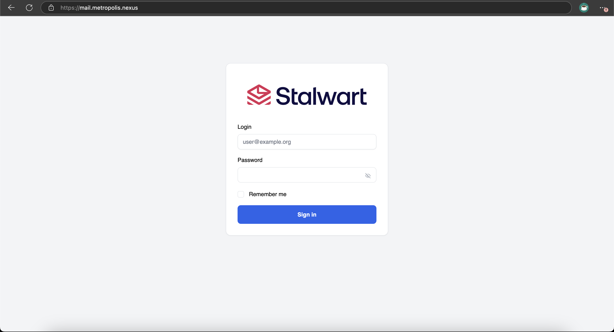
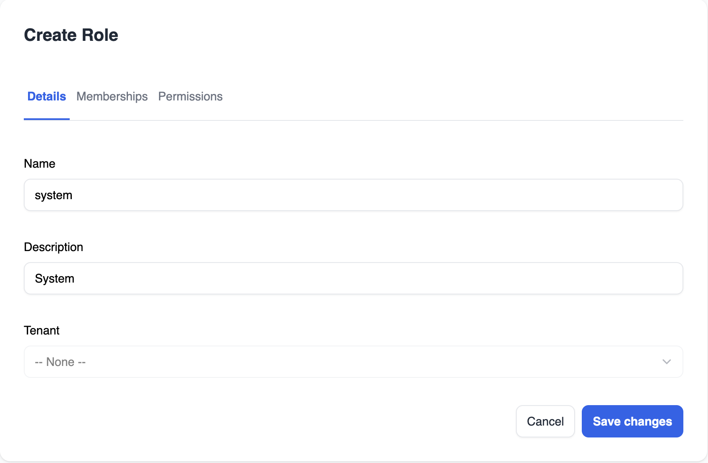
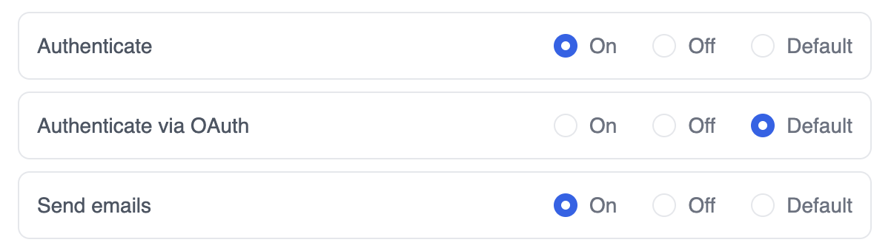

# Stalwart-Setup

## Deploy NGINX

- Install required dependencies: 

```bash
sudo rpm-ostree install certbot nginx policycoreutils-python-utils
sudo reboot
```

- Run [setup.sh](https://github.com/Metropolis-nexus/NGINX-Setup) to get a simple standard NGINX setup.
- Generate a certificate for the mail server with certbot:

```bash
sudo certbot certonly \
    --webroot --webroot-path /srv/nginx \
    --no-eff-email \
    --key-type ecdsa \
    --reuse-key \
    --deploy-hook "nginx -s reload && systemctl restart stalwart" \
    -d mail.yourdomain.tld \
    -d mta-sts.yourdomain.tld \
    -d autoconfig.yourdomain.tld \
    -d autodiscover.yourdomain.tld
```

- Add `/etc/nginx/conf.d/stalwart.conf`:

```
server {
    listen 443 quic;
    listen 443 ssl;
    listen [::]:443 quic;
    listen [::]:443 ssl;

    server_name mail.yourdomain.tld mta-sts.yourdomain.tld autoconfig.yourdomain.tld autodiscover.yourdomain.tld;

    ssl_certificate /etc/letsencrypt/live/mail.yourdomain.tld/fullchain.pem;
    ssl_certificate_key /etc/letsencrypt/live/mail.yourdomain.tld/privkey.pem;
    ssl_trusted_certificate /etc/letsencrypt/live/mail.yourdomain.tld/chain.pem;

    include snippets/security.conf;
    include snippets/cross-origin-security.conf;
    include snippets/quic.conf;
    include snippets/proxy.conf;
    include snippets/robots.conf;
    include snippets/universal_paths.conf;

    add_header Content-Security-Policy "default-src 'none'; connect-src 'self'; img-src 'self' data:; manifest-src 'self'; script-src 'unsafe-eval'; script-src-elem 'self' 'unsafe-inline'; style-src 'unsafe-inline'; style-src-elem 'self' 'unsafe-inline'; form-action 'none'; frame-ancestors 'none'; block-all-mixed-content; base-uri 'none'";

    proxy_ssl_name mail.yourdomain.tld;

    location / {
        proxy_pass https://127.0.0.1:8443;
    }
}
```

## Deploy Stalwart

- Copy the appropriate Stalwart related files onto your system from [Quadlet-Files](https://github.com/Metropolis-nexus/Quadlet-Files).

**Note**: As of this writing (06/15/2026), the initial setup is a bit janky, but you need to follow it to make Stalwart read from the local configuration properly. Modifying `/srv/stalwart/stalwart/etc/config.toml` from the get-go will not work.

- Change `PublishPort=127.0.0.1:8443:443` to `PublishPort=443:443` in `/etc/systemd/containers/stalwart.container`

- Start the Stalwart target and get your admin password:

```bash
sudo systemctl daemon-reload
sudo systemctl enable --now stalwart.target
sudo systemctl status stalwart
```

At this point, your `config.toml` file should look somewhat like this:

```
[server.listener.smtp]
bind = "[::]:25"
protocol = "smtp"

[server.listener.submission]
bind = "[::]:587"
protocol = "smtp"

[server.listener.submissions]
bind = "[::]:465"
protocol = "smtp"
tls.implicit = true

[server.listener.imap]
bind = "[::]:143"
protocol = "imap"

[server.listener.imaptls]
bind = "[::]:993"
protocol = "imap"
tls.implicit = true

[server.listener.pop3]
bind = "[::]:110"
protocol = "pop3"

[server.listener.pop3s]
bind = "[::]:995"
protocol = "pop3"
tls.implicit = true

[server.listener.sieve]
bind = "[::]:4190"
protocol = "managesieve"

[server.listener.https]
protocol = "http"
bind = "[::]:443"
tls.implicit = true

[server.listener.http]
protocol = "http"
bind = "[::]:8080"

[storage]
data = "rocksdb"
fts = "rocksdb"
blob = "rocksdb"
lookup = "rocksdb"
directory = "internal"

[store.rocksdb]
type = "rocksdb"
path = "/opt/stalwart/data"
compression = "lz4"

[directory.internal]
type = "internal"
store = "rocksdb"

[tracer.log]
type = "log"
level = "info"
path = "/opt/stalwart/logs"
prefix = "stalwart.log"
rotate = "daily"
ansi = false
enable = true

[authentication.fallback-admin]
user = "admin"
secret = "REDACTED"
```

This means that Stalwart isn't reading new configs in `config.toml` just yet.

- Log into the web UI with your password
- Hit Settings on the left sidebar
- Network -> Set the hostname -> Hit "Save & Reload"
- System
    - Hit "Save & Reload" without any change
    - Change `store.*` to `*`. Delete all of the other local settings. Hit "Save & Reload" again
- Click on Listeners. Then click on System again. You may see that the local settings got repopulated below `*`. Delete all of them and hit "Save & Reload" yet again

Your `config.toml` file should now look like this:

```
authentication.fallback-admin.secret = "REDACTED"
authentication.fallback-admin.user = "admin"
config.local-keys = "*"
directory.internal.store = "rocksdb"
directory.internal.type = "internal"
server.hostname = "mail.yourdomain.tld"
server.listener.http.bind = "[::]:8080"
server.listener.http.protocol = "http"
server.listener.https.bind = "[::]:443"
server.listener.https.protocol = "http"
server.listener.https.tls.implicit = true
server.listener.imap.bind = "[::]:143"
server.listener.imap.protocol = "imap"
server.listener.imaptls.bind = "[::]:993"
server.listener.imaptls.protocol = "imap"
server.listener.imaptls.tls.implicit = true
server.listener.pop3.bind = "[::]:110"
server.listener.pop3.protocol = "pop3"
server.listener.pop3s.bind = "[::]:995"
server.listener.pop3s.protocol = "pop3"
server.listener.pop3s.tls.implicit = true
server.listener.sieve.bind = "[::]:4190"
server.listener.sieve.protocol = "managesieve"
server.listener.smtp.bind = "[::]:25"
server.listener.smtp.protocol = "smtp"
server.listener.submission.bind = "[::]:587"
server.listener.submission.protocol = "smtp"
server.listener.submissions.bind = "[::]:465"
server.listener.submissions.protocol = "smtp"
server.listener.submissions.tls.implicit = true
server.max-connections = 8192
server.socket.backlog = 1024
server.socket.nodelay = true
server.socket.reuse-addr = true
server.socket.reuse-port = true
storage.blob = "rocksdb"
storage.data = "rocksdb"
storage.directory = "internal"
storage.fts = "rocksdb"
storage.lookup = "rocksdb"
store.rocksdb.compression = "lz4"
store.rocksdb.path = "/opt/stalwart/data"
store.rocksdb.type = "rocksdb"
tracer.log.ansi = false
tracer.log.enable = true
tracer.log.level = "info"
tracer.log.path = "/opt/stalwart/logs"
tracer.log.prefix = "stalwart.log"
tracer.log.rotate = "daily"
tracer.log.type = "log"
```

This means that it will start reading from and writing to the `config.toml` file properly.

- Add the following at the end of `/srv/stalwart/stalwart/etc/config.toml`:

```
certificate.letsencrypt.cert = "%{file:/etc/letsencrypt/live/mail.yourdomain.tld/fullchain.pem}%"
certificate.letsencrypt.default = true
certificate.letsencrypt.private-key = "%{file:/etc/letsencrypt/live/mail.yourdomain.tld/privkey.pem}%"
certificate.letsencrypt.subjects = "mail.yourdomain.tld"
```

- Restart Stalwart:

```bash
sudo systemctl restart stalwart
```

Stalwart should load with the correct certitificate:



- Change `PublishPort=443:443` back to `PublishPort=127.0.0.1:8443:443` in `/etc/systemd/containers/stalwart.container`, then run:

```bash
sudo systemctl daemon-reload
sudo systemctl restart stalwart
sudo systemctl start nginx
```

## Configure Stalwart

- Top right -> Account -> Change password
- Restart Stalwart

### Listeners

Remove all unnecessary listeners (http, unencrypted IMAP, all POP3, Sieve).

The resulting configuration should look like this:


```
server.listener.https.bind = "[::]:443"
server.listener.https.protocol = "http"
server.listener.https.tls.implicit = true
server.listener.imaptls.bind = "[::]:993"
server.listener.imaptls.protocol = "imap"
server.listener.imaptls.tls.implicit = true
server.listener.smtp.bind = "[::]:25"
server.listener.smtp.protocol = "smtp"
server.listener.submission.bind = "[::]:587"
server.listener.submission.protocol = "smtp"
server.listener.submissions.bind = "[::]:465"
server.listener.submissions.protocol = "smtp"
server.listener.submissions.tls.implicit = true
```

### Storage

- Storage -> Stores -> Add PostgreSQL
    - Add:

```
store.postgresql.compression = "lz4"
store.postgresql.database = "stalwart"
store.postgresql.host = "stalwart-postgres"
store.postgresql.password = "REDACTED"
store.postgresql.pool.max-connections = 10
store.postgresql.port = 5432
store.postgresql.purge.frequency = "0 3 *"
store.postgresql.read-from-replicas = true
store.postgresql.timeout = "15s"
store.postgresql.tls.allow-invalid-certs = false
store.postgresql.tls.enable = false
store.postgresql.type = "postgresql"
store.postgresql.user = "stalwart"
```

- Storage -> Settings -> Change all data stores to PostgreSQL, Enable encryption at rest & Encrypt on append
    -  Change over from RocksDB & adjust:

```
email.encryption.append = true
email.encryption.enable = true
storage.blob = "postgresql"
storage.data = "postgresql"
storage.fts = "postgresql"
storage.lookup = "postgresql"
```

- Authentication -> Directories -> Change "internal"'s backend from RocksDB to PostgreSQL
    - Change over from RocksDB:

```
directory.internal.store = "postgresql"
```

- Storage -> Stores -> Delete RocksDB
    - Remove:

```
store.rocksdb.compression = "lz4"
store.rocksdb.path = "/opt/stalwart/data"
store.rocksdb.type = "rocksdb"
```

### HTTP

- Settings -> HTTP Headers -> Obtain remote IP from Forwarded header
    - Add:

```
http.use-x-forwarded = true
```

#### SMTP

- Inbound -> MTA-STS Policy -> Policy Application -> Enforce
    - Add:

```
session.mta-sts.max-age = "7d"
session.mta-sts.mode = "enforce"
```

- Outbound -> Allow Invalid Certs -> Delete "retry_num > 0 && last_error == 'tls' -> true" condition.
    - Add:

```
queue.outbound.tls.allow-invalid-certs = false
```

- Arc -> Arc Sealing -> Change `'rsa-' + config_get('report.domain')` to `'ed25519-' + config_get('report.domain')`
    - Add:

```
auth.arc.seal = "'ed25519-' + config_get('report.domain')"
auth.arc.verify = "relaxed"
```

### Spam filter

- Reputation -> Enable Reputation tracking
    - Add: 

```
spam-filter.reputation.enable = true
spam-filter.reputation.expiry = "30d"
spam-filter.reputation.factor = 0.5
spam-filter.reputation.score = 0.98
spam-filter.reputation.weight.asn = 0.1
spam-filter.reputation.weight.domain = 0.2
spam-filter.reputation.weight.ip = 0.2
spam-filter.reputation.weight.sender = 0.5
```

- Bayes classfier -> Enable user-specific Bayes classification

    - Add

```
spam-filter.bayes.account.enable = true
spam-filter.bayes.account.score.ham = 0.5
spam-filter.bayes.account.score.spam = 0.7
spam-filter.bayes.auto-learn.card-is-ham = true
spam-filter.bayes.auto-learn.enable = true
spam-filter.bayes.auto-learn.threshold.ham = -1.0
spam-filter.bayes.auto-learn.threshold.spam = 6.0
spam-filter.bayes.classify.balance = 0.9
spam-filter.bayes.classify.learns = 200
spam-filter.bayes.classify.strength = 0.05
spam-filter.bayes.classify.tokens.hits = 2
spam-filter.bayes.classify.tokens.min = 11
spam-filter.bayes.enable = true
spam-filter.bayes.score.ham = 0.5
spam-filter.bayes.score.spam = 0.7
spam-filter.header.bayes.enable = true
spam-filter.header.bayes.name = "X-Spam-Bayes"
```

## Manage Stalwart

### System role

We will make a new role for system services, where they can only send email but cannot recieve emails or access the web UI.

- Create new user role
- Enable "Authenticate" and "Send Mail" in permission settings



